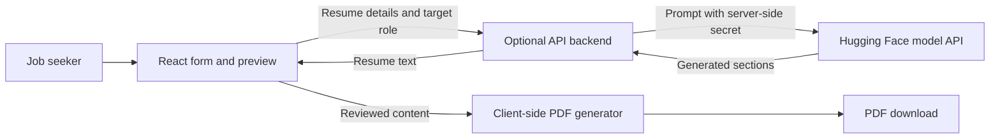

# Architecture

## Request Flow

For a model/API that explicitly supports safe public browser access, the frontend may call it directly. Never ship a private API token in the static site. The optional backend can run as a small Hugging Face Space and forward requests using a Space secret.

## Components

- **React frontend:** collects details, validates input, displays progress and errors, and lets the user edit generated content.
- **AI API:** turns the supplied facts and target role into resume language. The model must not invent employers, dates, qualifications, or achievements.
- **Resume generator:** formats the reviewed text for preview and creates a PDF in the browser with jsPDF (or an optional DOCX export library).

## Data and Privacy

There is no database and no account system. The app generates content on demand and keeps working data in browser memory for the session. When generation is requested, relevant details are sent to the chosen AI provider (directly or through the backend), whose own retention and privacy terms apply. Do not log resume contents on the backend by default.