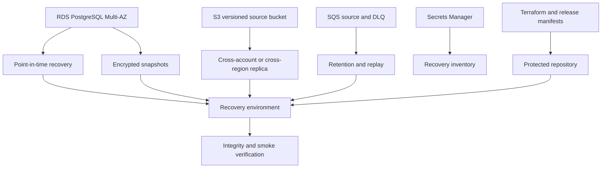

# Backup and Disaster Recovery

## Objectives
Backups protect against accidental deletion, corruption, operator error, ransomware, provider failure, and region-level disruption. Disaster recovery must restore a consistent AtlasAI knowledge state across PostgreSQL, S3, SQS, secrets, infrastructure, and embedding indexes.

## Recovery Targets
Define targets by customer plan before launch. Initial platform targets:

| Service/data | RPO | RTO | Recovery source |
|---|---:|---:|---|
| PostgreSQL metadata | 5 minutes | 2 hours | RDS PITR and snapshots |
| S3 source objects | 15 minutes | 4 hours | Versioned, replicated bucket |
| Search vectors | Rebuildable | 8 hours | PostgreSQL/source objects and embedding version |
| SQS jobs | At-least-once replay | 2 hours | Queue retention and source state |
| Secrets/config | 1 hour | 2 hours | Secrets Manager and Terraform |
| Audit records | 5 minutes | 4 hours | Protected database/sink backups |

RPO/RTO are service commitments only after restore drills demonstrate them.

## Backup Architecture

## PostgreSQL Protection
- Use RDS Multi-AZ for high availability, not as a substitute for backups.
- Enable automated backups and point-in-time recovery with policy-defined retention.
- Take encrypted snapshots before major migrations and destructive operations.
- Monitor backup completion and age; alert on failed or stale backups.
- Test restoring into an isolated account or VPC.
- Verify extensions, parameter groups, roles, RLS policies, indexes, and migration state after restore.
- Use separate recovery credentials and document who can perform restore.

## S3 Protection
- Enable block public access, versioning, encryption, object ownership, and lifecycle rules.
- Use replication or backup copies across accounts/regions according to residency and compliance requirements.
- Protect backup buckets from deletion by the production task role.
- Record object checksum, version ID, document version, parser version, and embedding version.
- Test restoration of source objects, derived extraction artifacts, and deletion markers.

## Queue and Job Recovery
SQS is at-least-once delivery. Handlers must be idempotent using document version and job keys. Retain messages long enough to cover incident response and replay. On recovery:
1. Stop consumers if processing would compound corruption.
2. Identify in-flight, visible, and dead-letter messages.
3. Verify database and object consistency.
4. Replay only safe message types from the documented boundary.
5. Monitor duplicates, failures, and queue age.
6. Reconcile job state against source/document state.

## Recovery Sequence
1. Declare incident severity and freeze destructive changes.
2. Establish a recovery environment from Terraform and approved images.
3. Restore KMS access, secrets, IAM roles, and network dependencies.
4. Restore PostgreSQL to the selected point in time.
5. Restore or attach the correct S3 object versions.
6. Verify migrations, RLS, retention controls, and document checksums.
7. Restore or recreate SQS queues and DLQs with correct policies.
8. Rebuild vector indexes from known source versions when required.
9. Start workers in paused or low-concurrency mode and reconcile jobs.
10. Start API and web tasks; run authentication, upload, retrieval, citation, and deletion smoke tests.
11. Compare recovered counts, checksums, audit events, and quality metrics with the incident baseline.
12. Restore traffic gradually and monitor SLOs.

## Vector Recovery
Vectors are derived data. Store enough metadata to reproduce them: embedding provider, model, dimension, metric, normalization, parser version, chunking version, and source checksum. Never declare recovery complete merely because the database is online; verify retrieval quality and citation correctness after rebuild.

## Backup Validation and Drills
- Daily automated backup status checks.
- Weekly sample object restore and checksum validation.
- Monthly database restore into an isolated environment.
- Quarterly full recovery exercise including queue replay and vector rebuild.
- Annual region or account recovery exercise when required by customer commitments.

Record achieved RPO/RTO, missing dependencies, data mismatches, operator actions, and follow-up owners.

## Backup Security
Use separate backup accounts or projects where feasible, KMS encryption, least-privilege restore roles, immutable retention for audit data, access logging, MFA for destructive actions, and alerts for unusual backup reads or deletes. Backups inherit data classification and must not be copied to developer environments.

## Rollback Versus Recovery
A release rollback changes application code or configuration. Disaster recovery restores data and infrastructure after corruption, loss, or regional failure. Do not use a database restore to undo a normal application bug unless data integrity is affected and the recovery owner approves it.

## Common Mistakes
- Assuming Multi-AZ is a backup or recovery plan.
- Backing up PostgreSQL without source objects and encryption metadata.
- Replaying all queue messages without checking idempotency and data state.
- Restoring data into an environment with different RLS or migration versions.
- Declaring success when infrastructure is healthy but vector quality is degraded.
- Allowing production application roles to delete backup copies.