# CI/CD Strategy

## Purpose and Scope
This strategy defines how AtlasAI changes move from pull request to AWS production for the Next.js web application, Express API, Node.js workers, PostgreSQL migrations, RAG prompts, and infrastructure. The pipeline must produce reproducible, tested, scanned, provenance-attested artifacts and promote the same artifact through environments.

## Delivery Principles
- Build once and promote the immutable image digest; do not rebuild for staging or production.
- Keep application, worker, prompt, migration, and infrastructure versions traceable to one release identifier.
- Use GitHub Actions with GitHub OIDC federation to AWS; never store long-lived AWS access keys in GitHub secrets.
- Keep pull-request jobs fast and deterministic; run expensive integration, evaluation, and deployment jobs only after required checks pass.
- Treat database migrations as versioned production code with compatibility and rollback plans.
- Fail closed on missing tests, security findings, provenance, approvals, or environment policy.
- Never expose production customer data to pull-request or development jobs.

## Pipeline Stages

```mermaid
flowchart LR
  PR[Pull request] --> Verify[Format lint typecheck unit tests]
  Verify --> Contract[Contract and authorization tests]
  Contract --> Scan[Secrets dependencies SAST IaC]
  Scan --> Build[Build and sign images]
  Build --> SBOM[SBOM and provenance]
  SBOM --> Eval[AI evaluation and security tests]
  Eval --> Preview[Terraform plan and ephemeral checks]
  Preview --> Merge[Protected main]
  Merge --> Stage[Deploy staging]
  Stage --> Smoke[Smoke resilience and migration checks]
  Smoke --> Approval[Production approval]
  Approval --> Prod[Canary or blue-green production]
  Prod --> Observe[Verify SLOs and release health]
```

## Pull Request Pipeline
Required checks:
1. Repository policy and changed-file detection.
2. pnpm lockfile validation, formatting, ESLint, strict TypeScript compilation.
3. Unit tests for domain, authorization, chunking, scoring, and error mapping.
4. PostgreSQL integration tests including RLS and tenant-isolation negatives.
5. API, SSE, and provider contract tests.
6. Secret, dependency, license, SAST, and IaC scans.
7. Dockerfile lint and non-root image build.
8. Terraform formatting, validation, and policy checks.
9. Targeted RAG evaluation when prompts, retrieval, embeddings, or AI adapters change.

## Main Branch Pipeline
A merge to protected `main` publishes images for `web`, `api`, and `worker`, plus a migration artifact. Each image is tagged with the commit SHA and signed. The pipeline stores the immutable digest, SBOM, test reports, evaluation report, Terraform plan, and deployment metadata.

## Deployment Promotion
The staging deployment uses the exact image digests built from `main`. Production promotion requires environment approval, a clean staging smoke test, migration compatibility confirmation, open-risk review, and a deployment window where applicable. Production uses a canary or blue-green strategy and pauses automatically when health checks or SLO indicators fail.

## Gates and Ownership
| Gate | Required evidence | Owner |
|---|---|---|
| Code quality | lint, typecheck, tests | Engineering |
| Security | no blocking findings or approved exception | Security |
| AI quality | evaluation thresholds and report | AI quality |
| Infrastructure | reviewed Terraform plan | Platform |
| Data safety | migration and rollback plan | Data/platform |
| Production | approval and rollback readiness | Release manager |

## Rollback Strategy
- Application rollback: redeploy the previous signed image digest.
- Configuration rollback: restore the previous versioned parameter set or feature-flag state.
- Prompt/model rollback: disable the feature flag and restore the previous prompt/model versions.
- Migration rollback: use an explicitly tested down migration only when safe; otherwise deploy a forward compatibility migration.
- Infrastructure rollback: apply the previous reviewed Terraform plan, never edit production resources manually.
- Data rollback: restore through the documented recovery procedure; do not rewrite customer data from an unreviewed script.

## Required Pipeline Controls
- GitHub environment protection for staging and production.
- Minimal `permissions` per workflow and job.
- Concurrency cancellation for superseded pull requests and serialized production deployments.
- Artifact retention aligned to audit and incident-response needs.
- No secrets in build logs, test output, Docker layers, artifacts, or Terraform plans.
- Dependency and base-image refresh automation with an owner and SLA.

## Common Failure Modes to Prevent
- Rebuilding an image during deployment and losing reproducibility.
- Running migrations after an incompatible application is already live.
- Using mutable tags such as `latest` for production.
- Allowing forked pull requests to access deployment credentials.
- Treating a green unit-test run as evidence that tenant isolation or RAG quality is safe.

## Definition of Done
The CI/CD system is ready when a reviewer can trace a production task revision to its Git commit, source dependencies, image digest, SBOM, Terraform plan, migration version, prompt version, evaluation result, approvals, and post-deployment health verification.