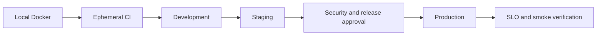

# Environment Management

## Environment Model
AtlasAI uses isolated environments with separate AWS accounts where feasible. Application artifacts are promoted unchanged; only environment configuration, capacity, endpoints, and secrets differ.

| Environment | Purpose | Data | Deployment source | Approval |
|---|---|---|---|---|
| Local | Developer workflow | Synthetic only | Local Docker | None |
| CI | Automated validation | Ephemeral fixtures | Pull request commit | Automated |
| Development | Shared integration | Synthetic or approved test data | Main branch | Team owner |
| Staging | Production rehearsal | Sanitized or synthetic data | Approved artifact | Platform/security |
| Production | Customer traffic | Customer data | Approved release | Release manager |

## Environment Isolation
- Use separate AWS accounts for production and non-production when possible.
- Use separate VPCs, RDS instances, S3 buckets, SQS queues, KMS keys, Secrets Manager paths, and OIDC deployment roles.
- Do not share production database snapshots, object buckets, logs, prompts, or customer exports with lower environments.
- Use separate OpenAI projects or credentials with independent limits and billing attribution.
- Prevent production network access from developer laptops and pull-request runners.

## Configuration Classes
1. **Build configuration:** committed and immutable, such as Node version and package lock.
2. **Runtime configuration:** environment-specific non-secret values, such as log level, queue URL, feature flags, and AWS region.
3. **Secrets:** API keys, database passwords, signing keys, OIDC secrets, and connector credentials.
4. **Data policy:** retention, budget, model allowlist, region, and workspace plan limits.

Runtime configuration is validated at startup. Secrets are injected from AWS Secrets Manager or task-role access and never committed, baked into images, or exposed to browser bundles.

## Configuration Example
```text
NODE_ENV=production
AWS_REGION=us-east-1
APP_ENV=production
DATABASE_URL=provided-at-runtime
SQS_INGESTION_QUEUE_URL=provided-at-runtime
S3_DOCUMENT_BUCKET=atlasai-prod-documents
OPENAI_MODEL_ALLOWLIST=gpt-4.1-mini,gpt-4.1
MAX_REQUEST_TOKENS=12000
LOG_LEVEL=info
```

The example contains names and safe values only. Database URLs and credentials must not be stored in `.env` files in deployed environments.

## Secrets Lifecycle
- Create secrets through Terraform or a controlled provisioning process.
- Grant read access to only the ECS task role that needs each secret.
- Rotate provider, database, signing, and connector credentials on defined schedules.
- Support overlapping credentials during rotation so old and new tasks can coexist.
- Record rotation events without recording secret values.
- Revoke compromised credentials immediately and redeploy affected tasks.

## Feature Flags
Feature flags are namespaced by environment and workspace plan. Flags must have an owner, purpose, default, expiry date, and rollback behavior. Security and authorization flags fail closed. Model, prompt, retrieval, and agent flags must record the active version in telemetry.

## Database Configuration
Each environment has its own migration history. Use forward-compatible migrations and run them through the deployment pipeline. Never point local or staging application code at production. Use masked seed data and separate database roles for migration, application read/write, read-only reporting, and operations.

## Environment Promotion


## Drift Management
All AWS resources are managed through Terraform. Scheduled plans detect drift. Manual changes require an incident or emergency change record, must be imported or codified afterward, and cannot become the normal operating path.

## Access Management
Use least privilege, just-in-time production access, MFA, short-lived sessions, and separate operator roles. Review access quarterly and after role changes. Break-glass access requires approval, a time limit, enhanced audit logging, and post-use review.

## Common Mistakes
- Copying production data into staging for convenience.
- Treating environment variables as inherently safe secrets.
- Changing production configuration manually without recording it.
- Reusing the same KMS key or IAM role across environments.
- Allowing a feature flag to bypass authorization or tenant isolation.