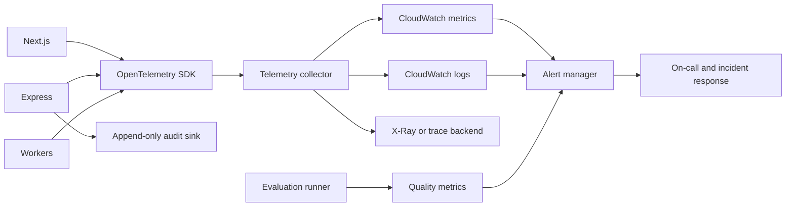

# Monitoring and Observability

## Objectives
Observability must answer four questions quickly: Is the system available? Is it safe and authorized? Is the answer useful and grounded? Is it operating within cost and capacity limits? Logs, metrics, traces, audit events, and evaluations must work together without exposing customer content.

## Signals
- **Metrics:** rates, durations, saturation, queue age, token usage, cost, quality, and security events.
- **Logs:** structured operational events with correlation IDs and redacted metadata.
- **Traces:** request flow across Next.js, Express, PostgreSQL, SQS, S3, workers, and OpenAI.
- **Audit events:** security-relevant actor and resource actions with append-only semantics.
- **Evaluations:** retrieval, citation, groundedness, abstention, injection, and model-regression results.

## Critical Service-Level Objectives
Initial targets from the project requirements:

| SLO | Target | Alert signal |
|---|---:|---|
| API availability | 99.9% | 5xx and failed health checks |
| Query first token | p95 < 2.5 s | trace span duration |
| Complete answer | p95 < 8 s | request duration |
| Retrieval | p95 < 1.5 s | retrieval span duration |
| Ingestion failure | < 2% | terminal job outcomes |
| Queue age | < 60 s normal | oldest message age |
| Citation validity | >= 95% successful answers | validator metric |
| Cross-tenant authorization failures | 0 tolerated | security event |

Targets must be baselined with representative load and reviewed after the pilot.

## Architecture


## Metric Catalog
### Application
- Request count, success/error count, status code, route, workspace plan, and region.
- p50/p95/p99 latency, time to first byte, and time to first token.
- SSE active connections, disconnects, reconnects, cancellations, and terminal failures.
- API rate-limit responses, validation failures, and authorization denials.

### Ingestion and SQS
- Messages sent, received, completed, retried, delayed, and dead-lettered.
- Oldest message age, visible/in-flight count, handler duration, and failure category.
- Document freshness, extraction duration, chunk count, embedding duration, and searchable transition failures.

### Database and AWS
- RDS CPU, memory, storage, connections, locks, replication, checkpoints, slow queries, and vector query duration.
- S3 request errors, object counts, storage growth, lifecycle failures, and access-denied events.
- ECS task restarts, deployment failures, CPU, memory, task count, and target health.
- OpenAI request rate, latency, retry count, timeout count, tokens, estimated cost, and provider error class.

### AI Quality and Cost
- Retrieval recall@k, MRR/nDCG, citation precision/recall, groundedness, abstention rate, and injection-test pass rate.
- Input/output tokens, embeddings, retry cost, cost per query, cost per workspace, and budget rejection count.
- Prompt/model/retrieval version as bounded metric dimensions or trace attributes; never use raw prompt text as a metric label.

## Structured Log Example
```json
{
  "timestamp": "2026-09-25T12:00:00Z",
  "level": "info",
  "event": "answer.completed",
  "requestId": "req_01J",
  "workspaceIdHash": "sha256:...",
  "actorIdHash": "sha256:...",
  "conversationId": "conv_01J",
  "model": "approved-model-id",
  "promptVersion": "answer.v3",
  "retrievalVersion": "hybrid.v2",
  "citationCount": 3,
  "latencyMs": 4210,
  "inputTokens": 1840,
  "outputTokens": 260,
  "groundingStatus": "validated"
}
```

Never log access tokens, API keys, raw document text, full prompts, full model output, database URLs, or customer content by default. Use a controlled, time-limited redacted diagnostic mode for incident response.

## Alerting Policy
Every alert must have severity, owner, condition, runbook, notification route, and suppression behavior. Page on-call for user-impacting SLO breaches, cross-tenant signals, credential misuse, production deployment failure, database risk, and queue data-loss risk. Ticket lower-severity trends.

Use multi-window burn-rate alerts for availability and query success. Avoid alerting on one transient provider failure; alert when retries, latency, or error budget consumption indicate customer impact.

## Dashboards
Create dashboards for:
1. Executive/service health: availability, active users, answer success, cost, and incidents.
2. API and frontend: routes, latency, streams, browser errors, and Core Web Vitals.
3. Ingestion: queue age, job states, freshness, failures, and DLQ.
4. AI quality: retrieval, citations, abstention, model versions, and evaluation trends.
5. Security: authorization denials, suspicious access, IAM, WAF, secrets, and audit events.
6. Database and infrastructure: RDS, ECS, S3, network, and OpenAI provider health.

## Incident Workflow
1. Detect and acknowledge the alert.
2. Assign incident commander and technical lead.
3. Establish impact, affected versions, workspaces, and timeline.
4. Contain with feature flags, rate limits, traffic shift, credential revocation, or rollback.
5. Preserve redacted evidence and audit events.
6. Verify recovery through SLOs and targeted smoke tests.
7. Communicate impact and resolution.
8. Complete a blameless review with corrective actions and new regression tests.

## Common Mistakes
- Logging sensitive content to make AI failures easier to inspect.
- Using unbounded workspace IDs, prompts, or document names as metric labels.
- Alerting on infrastructure symptoms without a user-impact signal.
- Measuring latency without queue, provider, database, and validation breakdowns.
- Treating AI quality as a one-time benchmark instead of a production signal.