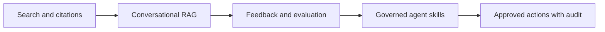

# Project Vision

## North Star
AtlasAI makes institutional knowledge as dependable to use as a well-maintained colleague: easy to ask, explicit about its sources, careful about access, and honest when the available evidence is incomplete.

## Strategic Thesis
AI adoption fails when answers are impressive but not verifiable, when governance is bolted on later, or when the workflow does not fit how teams already work. AtlasAI combines retrieval, permissions, evaluation, and human review into one product surface. The product earns trust through evidence rather than personality.

## Product Principles
1. **Evidence before eloquence:** retrieve authoritative passages before generation.
2. **Permission is part of meaning:** a document the user cannot access is not valid context.
3. **Progressive autonomy:** read-only assistance precedes proposed actions, and proposed actions precede approved execution.
4. **Operational truth:** every material model decision has an inspectable trace.
5. **Small feedback loops:** user feedback, evaluations, and incidents continuously improve retrieval and prompts.
6. **Provider independence:** model and vector integrations are replaceable at an explicit boundary.

## 12-Month Outcomes
- Establish a reliable knowledge assistant for pilot and production workspaces.
- Reach measurable citation correctness above 90% on curated evaluation sets.
- Add connectors for the most valuable approved sources without weakening access controls.
- Introduce governed agent skills that can draft, classify, and recommend actions.
- Build a defensible enterprise security posture with auditability and retention controls.

## Strategic Tradeoffs
We choose a narrower, observable feature set over broad autonomous behavior. We accept some additional latency for retrieval validation and permission checks. We use managed AWS services where they reduce undifferentiated operational work, but keep application logic portable through interfaces and infrastructure-as-code.

## Success Narrative
A user asks a policy question, receives a concise answer, opens the exact source passage, and can tell why the answer was selected. An administrator can explain who accessed which workspace, which model was used, what it cost, and whether a source is stale. An engineer can reproduce a failed answer from trace data without reading customer content by default.

## Mermaid: Capability Maturity

## Decision Filters
A feature is prioritized when it improves answer trust, reduces time to a verified outcome, protects data, or lowers operational risk. A feature is deferred when its value depends on opaque automation, requires broad permissions, or cannot be evaluated with representative test data.

## Mistakes to Avoid
- Measuring engagement without measuring correctness and source use.
- Calling a generic chat interface an AI product without a differentiated knowledge workflow.
- Promising autonomous action before identity, approval, and rollback semantics exist.
- Allowing roadmap pressure to bypass threat modeling or evaluation gates.
