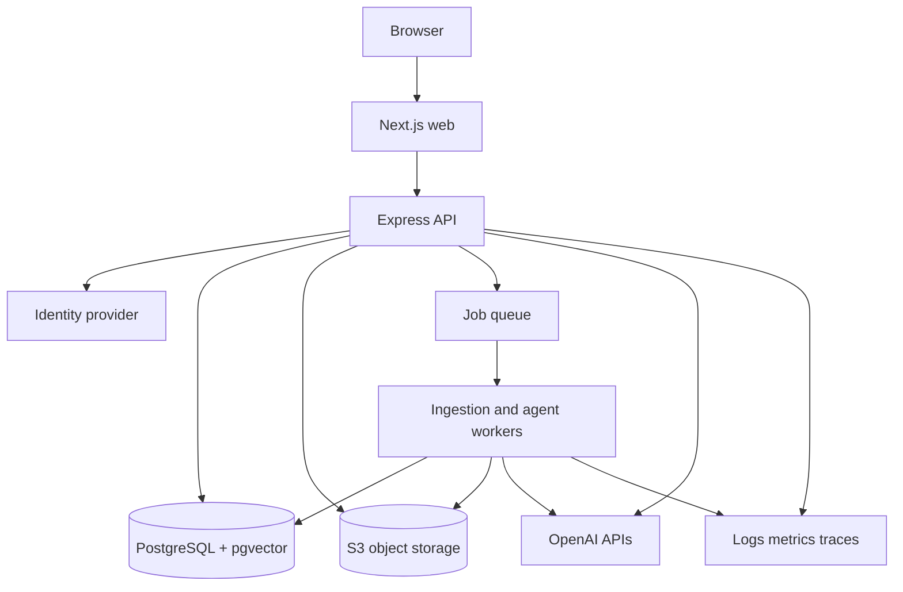

# System Architecture

## Architecture Style
Use a modular monorepo with a Next.js web application, an Express API, asynchronous workers, PostgreSQL with pgvector, object storage, and provider adapters. The web tier is stateless. Long-running ingestion and agent jobs run outside request handlers.

## Context and Containers

## Boundaries
- **Web:** rendering, form state, streaming client, accessibility, no provider secrets.
- **API:** authentication, authorization, input validation, orchestration, response contracts.
- **Worker:** extraction, chunking, embedding, indexing, evaluation, long-running agent runs.
- **Data:** relational truth, vector similarity, object bytes, encrypted secrets.
- **Provider adapters:** OpenAI, object storage, email, and future vector providers.

## Request Flow
Every request receives a correlation ID, validates authentication, resolves workspace membership, applies authorization, validates input, invokes a bounded use case, emits structured telemetry, and returns a typed response. Provider calls have deadlines, retry classification, and redaction-aware error mapping.

## Availability and Failure Strategy
The API remains stateless and horizontally scalable. Queue-backed work is retryable with exponential backoff and a dead-letter queue. Query requests may degrade to keyword search when vector retrieval is unavailable, but must label degraded behavior and never bypass authorization. Model unavailability returns a safe retryable error rather than an invented answer.

## Data Flow Controls
Use TLS in transit, encryption at rest, private subnets for data services, least-privilege IAM, separate environments, and tenant-aware query predicates. Document content is treated as sensitive. Logs contain IDs and hashes by default, not full prompts or source text.

## Architecture Decision Records
Record decisions for pgvector adoption, model selection, streaming protocol, identity integration, retention, and agent tool policy. Each ADR states context, decision, alternatives, consequences, and reversal conditions.

## Common Mistakes
- Calling providers directly from React components.
- Putting queue work in HTTP request handlers.
- Treating a database foreign key as sufficient tenant isolation.
- Sharing production credentials with local development.
- Adding a new service before measuring the current bottleneck.