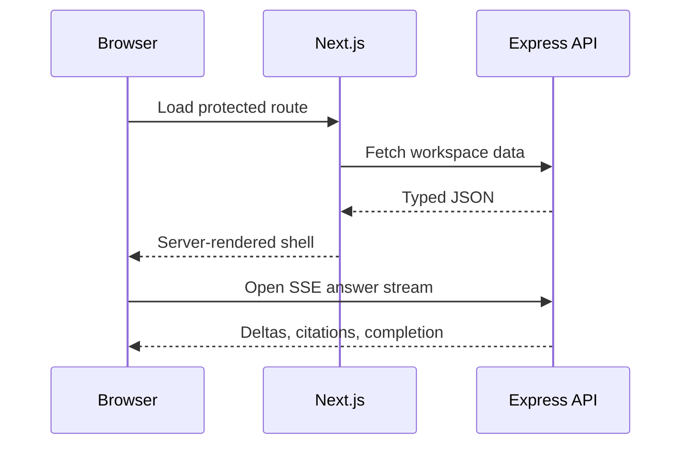

# Frontend Architecture

## Stack and Structure
Use Next.js App Router, React, TypeScript, and Tailwind CSS. Server Components render stable workspace and source data; Client Components handle interaction, streaming, upload progress, and local form state. Keep domain features organized by workflow rather than by generic component type.

```text
apps/web/
  app/                 route segments and layouts
  features/            chat, sources, administration
  components/          accessible shared primitives
  lib/                 API client, auth, telemetry
  styles/              tokens and global styles
  tests/               unit, integration, and browser tests
```

## Data and State
Use server-side fetching for initial route data and a typed API client for mutations. Keep URL state for filters and shareable views. Keep ephemeral UI state local. Use a query cache only where invalidation is explicit. Never put secrets, authorization decisions, or raw provider responses in client state.

## Chat Experience
Render streamed tokens incrementally but preserve a stable message shell. Citations are first-class linked elements with source title, version, and passage preview. Show loading, empty, partial, abstention, rate-limit, and provider-degraded states. Support canceling an in-flight request and retrying a failed request with the same visible question.

## Accessibility
Use semantic landmarks, labeled controls, logical focus order, keyboard-operable dialogs, visible focus indicators, and live-region announcements for stream status. Do not make color the only citation or error signal. Respect `prefers-reduced-motion`. Test with keyboard navigation and a screen reader before release.

## Performance
Use route-level code splitting, optimized images, streaming server rendering where helpful, and bounded client bundles. Avoid rendering thousands of chunks or messages at once; virtualize long histories only after measuring. Use `loading.tsx` and error boundaries intentionally, not as a replacement for useful state design.

## Mermaid: Browser Data Flow


## Common Mistakes
- Making every component client-side by default.
- Hiding stream failures until the user refreshes.
- Rendering markdown or citations without sanitization and safe link handling.
- Building a visually polished chat that cannot expose source provenance.
- Treating Tailwind utility usage as a substitute for design tokens.