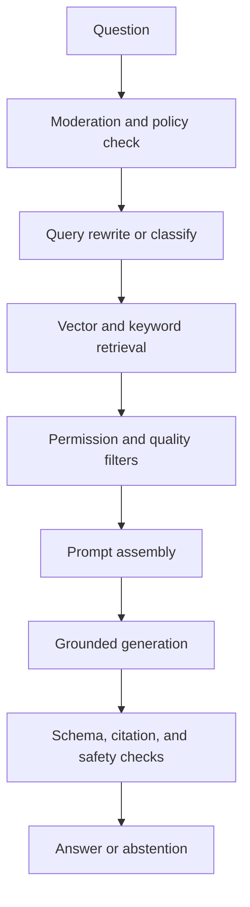

# AI Architecture

## Model Responsibilities
Use separate model roles: an embedding model for indexing and query vectors, a fast chat model for classification or query rewriting, and a stronger chat model for complex grounded answers. Model choice is configuration, not business logic. Persist model name, version, parameters, and prompt version with every material response.

## AI Gateway
All model calls go through an internal gateway that applies workspace policy, token budgets, timeouts, redaction, retry classification, structured output validation, and usage accounting. The gateway exposes provider-neutral interfaces and rejects calls lacking a tenant and correlation context.

## Answer Pipeline

## Grounding Policy
The model receives labeled context with source IDs and passage boundaries. It must answer only from context for factual claims, cite supporting passages, distinguish inference from direct evidence, and state when evidence is missing. A validator checks citation IDs and coverage before the answer is delivered.

## Safety and Abuse Controls
Classify prompt injection, sensitive-data requests, disallowed content, and attempts to override system instructions. Treat retrieved text as untrusted data, never as executable instructions. Apply output moderation where appropriate and provide a safe, useful refusal that does not disclose hidden policy text.

## Cost and Capacity
Set maximum input and output tokens per plan. Reserve a budget for system instructions and citations. Track provider cost by workspace and operation. Cache embeddings and safe deterministic classifications, but do not cache authorization-sensitive answers without a complete access key.

## Evaluation
Maintain golden questions with expected sources, adversarial injection documents, multilingual cases, no-answer cases, and permission-boundary tests. Track groundedness, citation precision/recall, retrieval recall, abstention quality, latency, and cost.

## Common Mistakes
- Letting the model decide whether a user is authorized.
- Sending entire documents instead of ranked passages.
- Treating prompt injection as a model-quality problem only.
- Changing models without rerunning evaluation sets.
- Claiming factual confidence without measuring evidence support.