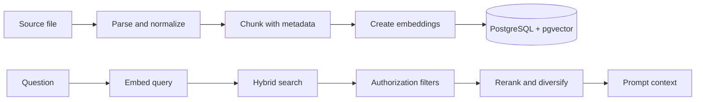

# RAG Architecture

## Ingestion Pipeline
1. Receive an authenticated upload or connector event.
2. Store the immutable source object and calculate a checksum.
3. Extract text with a versioned parser and preserve page or heading metadata.
4. Normalize whitespace while retaining meaningful structure.
5. Split into semantically coherent chunks with bounded token size and overlap.
6. Generate embeddings and persist chunks in a transaction-safe index operation.
7. Mark the document version searchable only after all chunks pass validation.

## Chunking Defaults
Start with 400 to 700 tokens and 10% to 15% overlap, then tune by document type and evaluation results. Keep headings, page numbers, section paths, and source offsets. Avoid splitting tables or code blocks blindly. A chunk must be understandable enough to support a citation without its entire document.

## Retrieval
Use hybrid retrieval: vector similarity for semantic matches and PostgreSQL full-text search for exact terms, identifiers, and policy names. Apply tenant, membership, source, document status, and visibility filters before ranking. Combine scores with a documented normalization method, then rerank a bounded candidate set when latency permits.

## Freshness and Deletion
Only fully processed current versions are searchable. Source updates create a new version. Deletion immediately removes eligibility from retrieval, then asynchronously removes vectors and objects according to retention policy. Record parser and embedding versions so reindexing is reproducible.

## Retrieval Evaluation
Use labeled query-source pairs. Measure recall@k, reciprocal rank, nDCG, citation precision, and answer groundedness. Include near-duplicate documents, stale versions, access-restricted passages, and queries containing exact IDs.

## Provider Migration
Store provider, model, dimension, and normalization metadata. A migration can build a parallel index, compare offline metrics, then switch a feature flag. Never mix vectors with incompatible dimensions in one index.

## Common Mistakes
- Chunking by character count with no semantic metadata.
- Searching before authorization filtering.
- Indexing stale and current versions together.
- Optimizing recall while ignoring citation readability.
- Assuming vector similarity handles exact names, codes, and numbers.