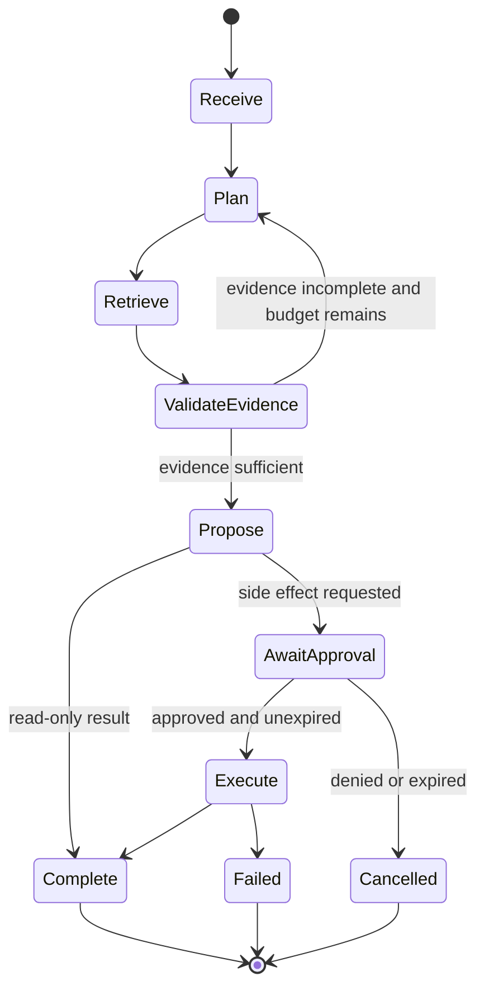

# Agent Design

## Scope
Agents are bounded workflows that can plan across approved tools. The initial agent set is read-only: knowledge researcher, document comparer, and answer reviewer. External side effects require a separate capability, explicit user approval, and an auditable execution record.

## Agent Loop

## Tool Contract
Each tool declares name, purpose, JSON schema, required permission, timeout, cost, and whether it has side effects. Validate arguments with a strict schema. Return typed results with source provenance. Tool output is untrusted content and must not override the system policy.

## Limits
Use maximum steps, wall-clock duration, model tokens, tool calls, and response size. Detect repeated calls and cyclic plans. Use a per-run budget and cancel work when the client disconnects where practical. Persist state transitions so an operator can resume or terminate a run safely.

## Approval Model
An approval names the exact action, parameters hash, target, expiry, and approving identity. Revalidate authorization and target state at execution time. Never treat a prior conversation message as approval for a new side effect. Make irreversible operations unavailable until a compensating action exists.

## Agent Evaluation
Test tool selection, argument correctness, refusal under injection, authorization boundaries, loop termination, partial failures, and approval expiry. Replay representative traces in CI with deterministic tool fakes.

## Common Mistakes
- Giving an agent a general-purpose network or shell tool.
- Allowing model-generated tool names or unvalidated arguments.
- Hiding intermediate plans from the user and operator.
- Automatically retrying a side effect after an uncertain timeout.
- Assuming an agent can safely see data merely because a user can.