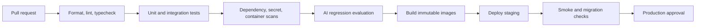

# DevOps Guide

## Repository and Environments
Use trunk-based development with short-lived branches and protected main. Maintain local, test, staging, and production environments with separate accounts or strong boundaries. Configuration is environment-specific; application artifacts are immutable across promotion.

## CI Pipeline

## Docker
Use multi-stage builds, a minimal non-root runtime image, pinned base images, a read-only filesystem where possible, and a health endpoint. Do not bake secrets into layers. Set CPU, memory, and process limits. Run separate images or commands for API and workers when scaling needs differ.

## GitHub Actions
Pin action versions to full commit SHAs where policy requires. Use OIDC federation to AWS instead of long-lived cloud keys. Restrict permissions per job, cache dependencies safely, upload test reports, and prevent untrusted pull-request code from accessing production secrets.

## Observability and Operations
Define dashboards for request latency, error rate, queue age, ingestion failures, model cost, database connections, and citation quality. Alerts need an owner, severity, threshold, runbook, and suppression strategy. Conduct game days for provider outages, database restore, credential rotation, and queue poison messages.

## Release Management
Use feature flags for model and retrieval changes. Record build SHA, migration version, prompt versions, and configuration snapshot. Deploy backward-compatible schema changes in phases. Roll back application code independently from data migrations when possible.

## Common Mistakes
- Building images on a developer laptop and deploying unverified artifacts.
- Giving every CI job broad cloud permissions.
- Alerting on raw log volume instead of user-impacting symptoms.
- Running migrations automatically without lock and rollback planning.
- Omitting worker versions from release tracking.