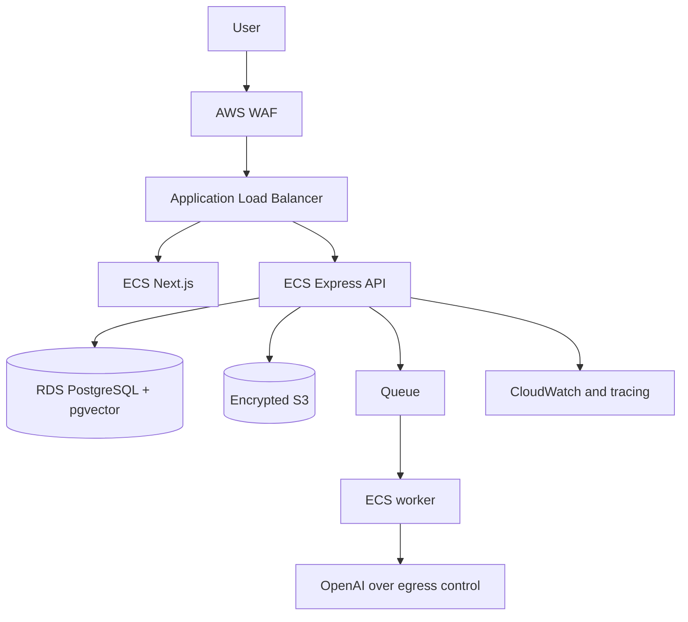

# Deployment Guide

## AWS Target Architecture
Run the web/API services on ECS Fargate or EKS according to team operating maturity. Use an Application Load Balancer, private subnets for services and data, RDS PostgreSQL with Multi-AZ, S3 for encrypted objects, ElastiCache or a durable queue for jobs, CloudWatch and OpenTelemetry for observability, Secrets Manager for secrets, and KMS for encryption.

## Deployment Sequence
1. Run CI and publish an immutable image.
2. Apply backward-compatible migrations.
3. Deploy API and workers with health checks.
4. Run smoke tests for authentication, source creation, query, and citation.
5. Shift traffic gradually or via blue/green deployment.
6. Monitor error, latency, queue, cost, and quality signals.
7. Record the release and configuration versions.

## Networking
Use private service and database subnets, restrictive security groups, VPC endpoints where useful, controlled outbound egress for model and connector calls, and no public database endpoint. Use WAF rules for common web abuse and ALB access logs with appropriate retention.

## Scaling
Scale API on CPU, memory, and request latency; scale workers on queue depth and job age. Cap concurrency based on database connections and provider limits. Use RDS connection pooling and monitor vector query plans as data grows.

## Disaster Recovery
Define RPO and RTO by plan. Test point-in-time database restoration, object version recovery, queue replay, secret recovery, and reindexing from source objects. Document the order of operations and who can declare failover.

## Common Mistakes
- Assuming multi-AZ eliminates the need for restore drills.
- Putting RDS or admin endpoints on public networks.
- Scaling workers without controlling model and database concurrency.
- Deploying a breaking migration before compatible application code.
- Forgetting that S3 deletion and vector deletion are separate workflows.