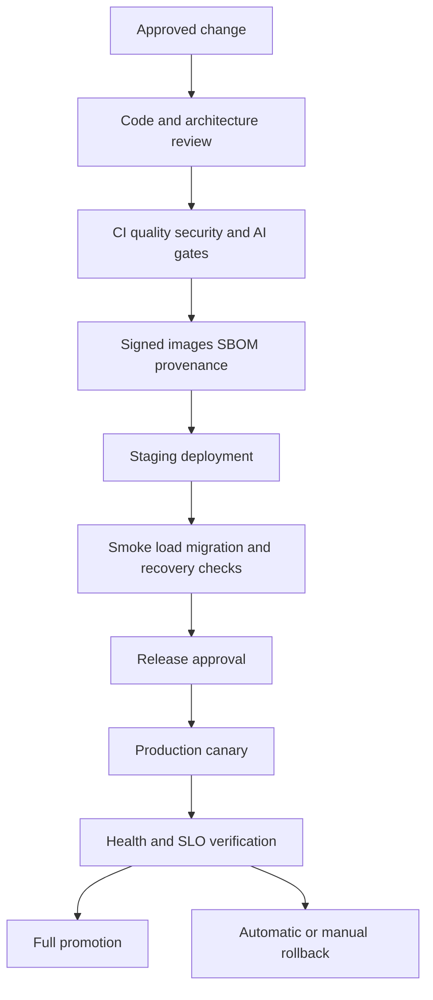

# Release Management

## Release Policy
A release is a signed, immutable set of application images, migration version, infrastructure plan, prompt versions, model configuration, feature-flag defaults, evaluation results, and operational notes. Release management protects customer data and ensures every production change can be explained and reversed.

## Release Types
- **Standard:** planned application, worker, frontend, or infrastructure change through the normal pipeline.
- **AI configuration:** prompt, model, embedding, retrieval, or evaluator change with additional quality gates.
- **Database:** schema or index change with compatibility and recovery analysis.
- **Emergency:** urgent security or availability correction with minimum review and mandatory retrospective.
- **Rollback:** redeployment or feature-flag reversal to a known-good release.

## Release Flow

## Release Checklist
- [ ] Change has an owner, linked issue, risk classification, and acceptance criteria.
- [ ] Required tests and scans pass on the exact commit.
- [ ] Image digests, migration version, prompt/model versions, and Terraform plan are recorded.
- [ ] Database migration is backward-compatible with the current and new application versions.
- [ ] AI changes have evaluation results, comparison to baseline, cost impact, and rollback flag.
- [ ] Security, privacy, and tenant-isolation impact is reviewed.
- [ ] Monitoring dashboards, alerts, and runbook links are ready.
- [ ] Deployment window, communication, and on-call coverage are confirmed.
- [ ] Rollback steps have been tested or explicitly classified as forward-fix only.

## Database Release Pattern
Use expand, migrate, contract:
1. Add nullable or additive schema elements.
2. Deploy code that supports old and new schema.
3. Backfill in bounded batches with progress and pause controls.
4. Switch reads/writes using a feature flag.
5. Validate data and metrics.
6. Remove obsolete schema only in a later release.

Never combine irreversible data deletion with a routine application deployment.

## Deployment Strategies
### Canary
Send a small percentage of traffic to the new task set, compare error rate, latency, citation validation, token cost, and business metrics, then increase in stages. Use automatic alarm rollback for critical signals.

### Blue-Green
Run old and new ECS services concurrently, validate the new target group, shift the ALB listener gradually or atomically, and retain the old task set until the observation window closes. Blue-green is preferred for high-risk API and frontend changes when capacity allows.

### Feature Flags
Use flags for model, prompt, retrieval, and agent changes. Flags must be server-enforced, tenant-aware, auditable, time-bounded, and capable of instant disablement without a rebuild.

## Rollback Procedures
### Application or Worker
1. Freeze further promotion.
2. Identify the previous signed image digest.
3. Confirm database compatibility.
4. Redeploy the previous ECS task definition.
5. Drain or quarantine incompatible queue messages if required.
6. Run smoke tests and verify alarms clear.
7. Record impact, duration, and follow-up action.

### AI Change
Disable the feature flag first when possible. Restore the previous prompt/model/retrieval configuration. Preserve failed traces and evaluation data for analysis. Do not delete evidence needed for incident review.

### Infrastructure
Stop the deployment, inspect the Terraform plan, and apply the last known-good reviewed plan. Do not use an ad hoc console change as the normal rollback.

### Database
Prefer a forward-compatible fix. Use a down migration only when it is tested, non-destructive, and safe with current data. For corruption or accidental deletion, invoke the disaster-recovery procedure rather than improvising SQL in production.

## Change Freeze
Freeze production changes during active security incidents, major outages, untested data backfills, or when on-call coverage is unavailable. Emergency changes remain subject to least privilege, logging, and retrospective review.

## Release Metadata
Store release ID, commit SHA, image digests, Terraform run ID, migration version, prompt/model versions, evaluation report, approvers, start/end times, alarms, and rollback outcome in an auditable release record.

## Common Mistakes
- Rolling back application code across an incompatible migration.
- Treating a prompt change as harmless configuration.
- Promoting by mutable image tag.
- Deleting the old task set before the observation period ends.
- Having rollback instructions that have never been exercised.